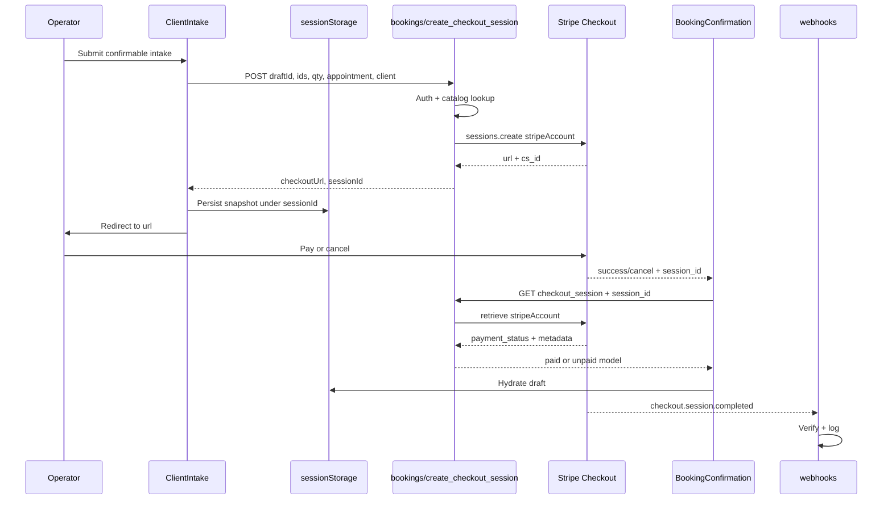
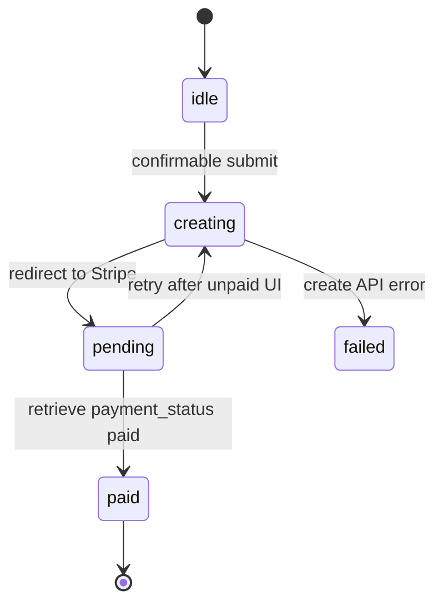

# SkinTwin Booking Stripe Checkout - Plan

## Goal Capsule

- **Objective:** Clinic operators complete a real Stripe Checkout payment on their connected account after intake, then see a paid or unpaid payment receipt instead of a fake `APT-` id. A durable clinic-schedule booking is out of scope.
- **Authority:** This plan. Product behavior is owned by the R-IDs. Implementation mechanism is owned by the KTD-IDs. Units cite those IDs and do not restate them.
- **Execution profile:** Standard, payments-risk. Add Vitest for server-owned pricing and route contracts. Keep `yarn validate-change` and `yarn build` green.
- **Stop conditions:** Stop if Checkout cannot be created as a direct charge on `session.user.stripeAccountId`. Stop if confirmation would still claim "Confirmed" without `payment_status === 'paid'`. Do not invent Mongo booking persistence, NGN presentment, or an application fee.
- **Tail ownership:** LFG owns review, commit, PR, and CI after implementation.

---

## Product Contract

### Summary

SkinTwin Connect already has a salon booking path (catalog, schedule, intake, confirmation). Intake currently mints a client-side `APT-` id and skips payment. This increment inserts hosted Stripe Checkout on the connected clinic account between intake and confirmation.

### Problem Frame

Operators believe they have paid for an appointment. The platform is a Stripe Connect product, but the booking path never charges the connected account. Confirmation is not durable across a Stripe redirect. This increment ships a payment receipt. It does not persist an appointment on a clinic schedule.

Product Contract preservation: Product Contract unchanged (bootstrap, no upstream brainstorm).

### Requirements

**Checkout gate**

- R1. After a confirmable booking (services + appointment + completed intake), submit starts Checkout instead of confirming.
- R2. Standalone intake (`?standalone=1`) still saves client details and never starts Checkout.
- R3. Confirmation never shows paid receipt copy unless Stripe reports `payment_status === 'paid'`. Paid copy does not claim the appointment is stored on a clinic schedule.

**Pricing and line items**

- R4. The server builds Checkout line items from catalog data. It rejects unknown service ids, invalid quantities, and add-ons not allowed by the parent service.
- R5. Catalog UI keeps NGN display prices. This increment charges only connected accounts whose `default_currency` is `usd`. Any other currency is a create-time `400`, not NGN presentment.
- R6. The Stripe `amount_total` and charge currency are the due amount. The NGN catalog total is captioned as display-only.

**Return and recovery**

- R7. Success and cancel URLs return to `/bookings/confirmation` with the Checkout Session id.
- R8. Cancel or unpaid return shows "Payment not completed", Retry payment, and Edit booking. The appointment summary appears only when the local draft exists.
- R9. A hard refresh with a valid `session_id` still shows paid or unpaid plus Stripe totals. Appointment details appear only when the local draft exists.

**Auth and isolation**

- R10. Unauthenticated or missing `stripeAccountId` requests receive `401` and create no session.
- R11. Session retrieve and webhook handling use the connected-account context. A session that does not belong to the operator's account is not shown as paid.

### Actors

- A1. Clinic operator — authenticated, onboarded Connect merchant. Completes hosted Checkout at the front desk on the client's behalf.
- A2. Client — intake subject and Checkout `customer_email`. Does not receive a payment link or portal.

### Key Flows

- F1. Paid booking
  - **Trigger:** Operator submits intake on a confirmable booking.
  - **Actors:** A1, A2
  - **Steps:** Mint draftId. Create Checkout Session. Persist snapshot under sessionId. Redirect to hosted Checkout. Operator pays on the front-desk hosted page. Return with `session_id`. Confirmation retrieves session and shows paid.
  - **Covered by:** R1, R3, R4, R6, R7, R9
- F2. Cancelled checkout
  - **Trigger:** Operator leaves Stripe without paying.
  - **Actors:** A1
  - **Steps:** Return to confirmation. Show unpaid state. Retry creates a new session from the same draft.
  - **Covered by:** R8
- F3. Standalone intake
  - **Trigger:** `/bookings/intake?standalone=1`.
  - **Actors:** A1, A2
  - **Steps:** Save intake. Navigate to `/clients`. No Stripe call.
  - **Covered by:** R2

### Acceptance Examples

- AE1. Covers R1, R3, F1. Given services, appointment, and consented intake, when the operator submits, they leave the app for Stripe and return to a paid receipt whose reference is a Stripe id, not `APT-`.
- AE2. Covers R8, F2. Given a cancel return, when confirmation loads the session, the page says payment was not completed and offers Retry payment.
- AE3. Covers R2, F3. Given standalone intake, when the operator saves, no Checkout Session is created.
- AE4. Covers R4, R10. Given a request with a client-supplied price or no `stripeAccountId`, the server rejects it.
- AE5. Covers R9. Given a paid session id and empty React context, a refresh still shows the appointment summary.

### Success Criteria

Operators can complete Stripe test-mode Checkout on a US `usd` connected account and see a paid or unpaid receipt. Confirmation does not claim the appointment is on a clinic schedule. Cancel does not show paid copy. CI still passes lint, TypeScript, new unit tests, and production build.

### Scope Boundaries

**In scope**

- New booking Checkout create/retrieve path, intake redirect, confirmation states, webhook acknowledgement, Vitest coverage.

**Deferred to Follow-Up Work**

- Mongo booking persistence and historical booking list.
- Real client lookup (replace the `adaeze.obi@example.com` demo).
- NGN presentment on Nigerian connected accounts.
- Application fees / platform pricing take.
- Playwright E2E against live Stripe.
- Closing remaining Issue #1 asset replacements.

**Outside this product's identity**

- Paystack Terminal (skintwin-salon rail).
- Unifying regima-suite or the LMS in this change.

---

## Planning Contract

### Assumptions

These inferred bets come from a headless LFG bootstrap of "skintwin platform". They are not user-settled.

- The next shippable platform increment is Connect Checkout for the existing salon booking flow in this repo.
- Display NGN vs charge USD is acceptable for US test Connect accounts if confirmation labels both.
- SessionStorage plus compact Checkout metadata is enough persistence for this increment.
- Webhook fulfillment is log-only until a booking model exists.

### Key Technical Decisions

- KTD1. New production route, not the debug route. Create `app/api/bookings/create_checkout_session/route.ts`. Reuse only the `{stripeAccount}` option from `app/api/payment_method_settings/create_checkout_session/route.ts`. Rejected: reuse the debug or settings-tester routes. Debug has no 401, random amounts, and a `/payments` return. Settings tester trusts client `amount`/`currency`. Governs R4, R10.
- KTD2. Direct charge on the connected account. Hosted Checkout (`mode: 'payment'`, redirect to `session.url`). Rejected: destination charges (`transfer_data`) and embedded Checkout via Account Sessions. Those change funds flow or keep payment inside Connect.js, which this repo already uses only for dashboard UI. Governs R1, R11.
- KTD3. Charge currency is the connected account `default_currency`. Each catalog service gains `usdChargeCents`. Server uses that integer as `unit_amount` when `default_currency` is `usd`. NGN `price` stays display-only. Rejected: `currency: 'ngn'` on US test Connect accounts created in `lib/auth.ts`. If `default_currency` is not `usd`, do not silently send NGN `price` as `unit_amount`. Governs R5, R6.
- KTD4. Client sends service ids, quantities, add-on ids, appointment, and client contact. Server looks up names and amounts in `app/data/services.json`. Reject a body that includes `unit_amount`, `amount`, `currency`, or `price_data`. Cap quantity at 10. Rejected: the settings-tester amount parser. Governs R4.
- KTD5. Success and cancel URLs are `${NEXTAUTH_URL}/bookings/confirmation?session_id={CHECKOUT_SESSION_ID}` with the literal `{CHECKOUT_SESSION_ID}` token. Accept only `cs_` ids. Unknown, foreign, and malformed ids share one not-found response. Rejected: `/payments` or `/settings` returns used by existing demo Checkout. Governs R7.
- KTD6. Mint `draftId` before create. After the route returns `sessionId`, persist the full snapshot in `sessionStorage` under that id, then redirect. Stripe metadata is `draftId`, `operatorAccountId`, and service/qty ids only. Email and appointment stay in `sessionStorage` plus Checkout `customer_email`. Rejected: Mongo booking persistence, React-context-only survival, and putting PII in metadata. Governs R9.
- KTD7. Confirmation paid-gate is a server retrieve: browser GET `/api/bookings/checkout_session`, then `checkout.sessions.retrieve` with `{stripeAccount: session.user.stripeAccountId}`. Ignore client-supplied account params. After retrieve, require `metadata.operatorAccountId === session.user.stripeAccountId` or return 404. `payment_status === 'paid'` is the paid receipt. Unpaid/canceled/expired is unpaid UI, not `failed`. `failed` is create API error only. Retrieve 401/404/not-found stay on the U4 taxonomy. Webhook is an async log, not the operator UI gate. Rejected: client-side Stripe retrieve, webhook-as-UI-gate, and treating a success URL as paid. Governs R3, R11.
- KTD8. Do not set `payment_intent_data.statement_descriptor`. The connected account already has `SKINTWIN`. Card Checkout rejects a full descriptor override. Governs R1.
- KTD9. No application fee. Enable `automatic_tax` only when connected-account Tax settings are `active`. Governs R6.
- KTD10. Add Vitest. Test the pure builder and mocked route/webhook without network Stripe. Append `yarn test` to CI after the existing `validate-change` / `build` jobs stay green. Governs Success Criteria.
- KTD11. First create uses Stripe `Idempotency-Key` derived from `draftId`. Retry after unpaid uses a new key and a new session. UI disable is not the only control. Governs R1, R8.

### High-Level Technical Design

Checkout is a five-stop protocol: intake mints a draftId, the API creates a connected-account session, intake persists the snapshot under that session id, Stripe hosts payment, confirmation retrieves the session, and the webhook logs fulfillment.

CheckoutState.status:

Unpaid, empty, and recovered-payment are confirmation UI derived from retrieve `payment_status` and draft presence. They are not extra `CheckoutState.status` values.

### Implementation Constraints

- Follow existing App Router JSON error shape `{error: string}` used by `app/api/account_session/route.ts`. Missing `stripeAccountId` is `401`, not the `400` that `account_session` uses.
- Success body is `{checkoutUrl, sessionId}`.
- API routes are outside `middleware.ts` matcher. Do not add `/api` to the matcher. Stripe webhooks have no NextAuth cookie.
- Drive `CheckoutState.status`. Derive unpaid UI from retrieve `payment_status` per KTD7. Do not add a second machine and do not map cancel onto `failed`.
- Do not store `cs_` in `invoiceId`. Add `checkoutSessionId` if needed.
- Keep `data-testid` values already on intake and confirmation. Add ids for unpaid and retry.
- Confirmation stays under `app/(dashboard)/`. Do not add Checkout to `app/api/account_session/route.ts`.
- `getTotalPrice` stays NGN catalog math. Do not pass Stripe `amount_total` into `formatCurrency`.

### Sequencing

U1 builder and catalog fields first. U2 route next. U3 intake redirect. U4 confirmation retrieve. U5 webhook. U5 is not the paid-gate. U1 tests expand as later units add helpers.

### System-Wide Impact

- Booking React state in `app/layout.tsx` dies on hosted Checkout redirect. R9 depends on KTD6 hydrate before the current empty-state render in `BookingConfirmation`.
- Three Checkout create contracts must stay separate. Booking returns `{checkoutUrl, sessionId}` and never imports debug or settings-tester handlers.
- Auth is three gates: page middleware, `AuthenticatedAndOnboardedRoute` (`details_submitted`), and per-route `getServerSession`. R10 is the API gate.
- Shared webhook must filter on booking metadata. Debug and settings Checkouts also emit `checkout.session.completed`.
- Confirmation never talks to Stripe from the browser. Retrieve is U4 GET then server `{stripeAccount}`.
- `EmbeddedComponentWrapper` can hide dashboard pages if Account Session fails. Leave confirmation in `(dashboard)` anyway.

---

## Implementation Units

### U1. Catalog charge amounts and checkout builder

- **Goal:** Server-owned line-item construction for the create-session route.
- **Requirements:** R4, R5
- **Dependencies:** none
- **Files:**
  - `app/data/services.json` (add `usdChargeCents` per service)
  - `app/contexts/booking/types.ts`
  - `lib/bookingCheckout.ts` (new)
  - `lib/bookingCheckout.test.ts` (new)
- **Approach:**
  1. Add `usdChargeCents` on every catalog service. For this increment set it equal to the existing NGN `price` integer so ₦8,500 displays as NGN and charges as $85.00 when the account currency is USD.
  2. Export `buildCheckoutLineItems(selections, catalog, chargeCurrency)` that returns Stripe `price_data` line items, display total, and charge total. Reject empty baskets, unknown ids, `quantity < 1` or `quantity > 10`, and illegal add-ons.
  3. Keep display math in `BookingContext.getTotalPrice` unchanged (NGN `price`).
- **Patterns to follow:** `lib/salon.ts` `serviceById`; catalog types in `app/contexts/booking/types.ts`.
- **Execution note:** Implement the builder test-first.
- **Test scenarios:**
  - Happy path: two services plus one legal add-on produce matching line items, NGN display total, and USD cents total.
  - Edge: quantity 2 multiplies only the parent service display and charge amounts. Each add-on is added once, matching `BookingContext.getTotalPrice`.
  - Error: unknown `serviceId` throws a typed validation error.
  - Error: add-on id not listed on the parent service is rejected.
  - Edge: empty selections are rejected.
  - Error: quantity 11 is rejected.
- **Verification:** Builder tests pass. Catalog TypeScript still typechecks.

### U2. Authenticated booking Checkout Session route

- **Goal:** Create a direct-charge Checkout Session from a validated basket.
- **Requirements:** R1, R4, R7, R10, R11
- **Dependencies:** U1
- **Files:**
  - `app/api/bookings/create_checkout_session/route.ts` (new)
  - `app/api/bookings/create_checkout_session/route.test.ts` (new)
- **Approach:**
  1. `getServerSession(authOptions)`. `401` `{error}` when `stripeAccountId` is missing.
  2. Parse JSON body. Return `400` if it contains `unit_amount`, `amount`, `currency`, or `price_data`. Run U1 builder. Never read client prices.
  3. Retrieve the connected account. If `default_currency` is not `usd`, return `400` and do not create. When KTD9 enables tax, copy the debug route tax_behavior and tax_code companion fields.
  4. `stripe.checkout.sessions.create` with `price_data` line items, `customer_email`, compact metadata per KTD6, URLs per KTD5, `{stripeAccount}`, and `Idempotency-Key` `booking-checkout:${draftId}` on first create. Honor KTD8 and KTD9. Log only `session.id` and `draftId`.
  5. Return `{checkoutUrl, sessionId}`. On Stripe or validation failure return JSON `{error}` with `400` or `500`. Do not import debug or settings-tester handlers.
- **Patterns to follow:** Auth guard in `app/api/payment_method_settings/create_checkout_session/route.ts`. JSON errors in `app/api/account_session/route.ts`. Brand descriptor constant in `lib/brand.ts` stays on the account, not on this create call.
- **Test scenarios:**
  - Happy path: mocked Stripe create is called with `stripeAccount` and server-built `unit_amount` values.
  - Error: no session returns 401 and does not call Stripe.
  - Error: body with `unit_amount`, `amount`, or `currency` returns 400 and does not call Stripe.
  - Error: empty or unknown service list returns 400.
  - Error: quantity 11 returns 400.
  - Error: connected account `default_currency` other than `usd` returns 400 and does not create.
  - Integration: `success_url` contains the literal `{CHECKOUT_SESSION_ID}` token.
  - Integration: two POSTs with the same `draftId` send the same Idempotency-Key.
- **Verification:** Route tests pass with mocked `stripe` and `getServerSession`.

### U3. Intake starts Checkout and persists the draft

- **Goal:** Confirmable intake redirects to Stripe. Standalone intake does not.
- **Requirements:** R1, R2
- **Dependencies:** U2
- **Files:**
  - `app/components/skintwin/ClientIntake.tsx`
  - `lib/bookingDraft.ts` (new sessionStorage helper)
  - `lib/bookingDraft.test.ts` (new)
  - `app/contexts/booking/types.ts` (add `checkoutSessionId` if needed)
- **Approach:**
  1. On confirmable submit, set checkout `creating`, mint `draftId`, POST U2, persist the snapshot under the returned `sessionId`, then `window.location.assign(checkoutUrl)`.
  2. While `creating`, set the submit label to "Redirecting to payment", `aria-busy="true"`, and disabled. Single-flight the request.
  3. On API error, set checkout `failed`, stay on intake, restore "Continue to payment", and show the API error in `aria-live="assertive"` with `data-testid="error-checkout"`. Do not navigate to confirmation.
  4. Remove the `APT-` invoice mint on this path.
  5. Standalone path stays save → `/clients`.
  6. Change the confirmable button label to "Continue to payment". Keep `data-testid="continue-to-checkout"`.
- **Patterns to follow:** Existing intake validation. Testdata checkout redirect via `window.location`.
- **Test scenarios:**
  - Happy path: draft helper round-trips a snapshot by session id.
  - Edge: overwrite of the same key replaces the previous draft.
  - Error: missing window/sessionStorage is a no-throw miss (returns null).
- **Verification:** Intake no longer writes `APT-` on the confirmable path. Standalone path has no fetch to the booking checkout route.

### U4. Confirmation retrieve and paid/unpaid UI

- **Goal:** Confirmation reflects Stripe payment status and survives refresh.
- **Requirements:** R3, R6, R7, R8, R9, R11
- **Dependencies:** U2, U3
- **Files:**
  - `app/api/bookings/checkout_session/route.ts` (new GET retrieve)
  - `app/api/bookings/checkout_session/route.test.ts` (new)
  - `app/components/skintwin/BookingConfirmation.tsx`
  - `app/(dashboard)/bookings/confirmation/page.tsx` (Suspense if search params require it)
- **Approach:**
  1. Stay pending until retrieve or draft resolve. Do not treat remount `idle` as empty. Pending copy: heading "Checking payment", body "Retrieving the Stripe Checkout session.", `aria-live="polite"`.
  2. GET retrieve uses `getServerSession` and Stripe retrieve per KTD7. Unknown, foreign, and malformed (non-`cs_`) ids all return 404. Skip Stripe retrieve only for non-`cs_` ids. Log only `session.id` and `draftId`.
  3. Write services, appointment, and client from the sessionStorage snapshot into `BookingContext` before painting paid or unpaid UI. Render draft PII only when retrieve returns 200. On 401/404, use empty state and delete that sessionStorage key.
  4. Paid: heading "Payment received", eyebrow "Paid". Show Payment Intent or Checkout Session id. Charged line is Stripe `amount_total` plus currency. Catalog total (NGN) is display-only. Do not claim the appointment is on a clinic schedule.
  5. Unpaid/expired/canceled: heading "Payment not completed", eyebrow "Payment incomplete". Hide Print receipt. Retry POSTs U2 with `Idempotency-Key` `booking-checkout:${draftId}:${attempt}` starting at 2, persists the same snapshot under the new `sessionId`, then redirects. Edit booking loads the draft into `BookingContext` before `/bookings/intake`.
  6. Missing session id and missing draft after load: keep the existing empty-state link to `/services`.
  7. When `session_id` retrieve succeeds but the draft is missing, do not use empty-state. Show paid or unpaid plus Stripe totals, reconstruct services from metadata ids, omit appointment and email, and say the local draft was lost.
  8. Delete both `APT-` sources in `BookingConfirmation.tsx`: the invoice-mint `useEffect` and `fallbackConfirmationNumber`. Until retrieve resolves, show no reference.
- **Patterns to follow:** Existing confirmation `data-testid`s. Empty-state copy already in `BookingConfirmation`.
- **Test scenarios:**
  - Happy path: retrieve `paid` maps to confirmed UI model with Stripe reference.
  - Edge: retrieve `unpaid` maps to retry model, never confirmed.
  - Error: retrieve without `stripeAccount` returns 401.
  - Error: foreign `cs_` or metadata `operatorAccountId` mismatch returns 404 and is not paid. Client-supplied `stripeAccount` is ignored.
  - Error: non-`cs_` `session_id` returns the same 404 as a foreign id and does not call Stripe.
  - Error: Stripe `resource_missing` looks like not-found, not unpaid-as-own, and is not paid.
  - Integration: confirmation helper hydrates appointment from sessionStorage after retrieve succeeds.
  - Integration: paid retrieve with missing draft shows Stripe totals and metadata service ids, not the empty-state.
- **Verification:** No confirmation code path sets `APT-`. Paid copy is gated on `payment_status`.

### U5. Connect webhook acknowledgement

- **Goal:** Accept `checkout.session.completed` for connected-account Checkout without claiming operator UI fulfillment.
- **Requirements:** R11
- **Dependencies:** U2
- **Files:**
  - `app/api/webhooks/route.ts`
  - `app/api/webhooks/route.test.ts` (new)
- **Approach:**
  1. Keep existing signature verification and `account.updated` no-op.
  2. On `checkout.session.completed` and `checkout.session.async_payment_succeeded`, require `event.account`. Retrieve with `{stripeAccount: event.account}`. Ignore events whose metadata lacks a booking `draftId` or whose `event.account` does not match `metadata.operatorAccountId`. Log `session.id`, retrieved `payment_status`, and `draftId` only.
  3. Do not trust `event.data.object.payment_status` without retrieve. Return `200` for unknown types. Do not persist a booking.
- **Patterns to follow:** Current raw-body `req.text()` + `constructEvent` in `app/api/webhooks/route.ts`.
- **Execution note:** Mock `constructEvent`. Do not call live Stripe in CI.
- **Test scenarios:**
  - Happy path: completed Connect event with `event.account` retrieves and logs paid.
  - Edge: platform event without `event.account` is ignored without retrieve.
  - Edge: completed event without booking `draftId` is ignored.
  - Error: retrieve `payment_status` unpaid is not logged as paid.
  - Error: missing signature returns 400.
  - Error: bad signature returns 400.
- **Verification:** Existing webhook contract still returns JSON `{}` on success.

### U6. Test runner and CI hook

- **Goal:** Make the new tests part of the repo gate.
- **Requirements:** Success Criteria
- **Dependencies:** U1
- **Files:**
  - `package.json`
  - `.github/workflows/test.yml`
  - `vitest.config.ts` (new, if needed)
- **Approach:**
  1. Add Vitest as a devDependency. Script `test` runs `vitest run`.
  2. After `validate-change` and `build`, CI runs `yarn test`.
  3. Do not add Playwright.
- **Test expectation:** none -- packaging only. Behavioral coverage lives on U1–U5.
- **Verification:** `yarn test`, `yarn validate-change`, and `yarn build` succeed.

---

## Verification Contract

| Gate       | Command                      | Proves                                                | Units |
| ---------- | ---------------------------- | ----------------------------------------------------- | ----- |
| Unit       | `yarn test`                  | Builder, draft helper, mocked route/webhook contracts | U1–U5 |
| Types/lint | `yarn validate-change`       | Existing lint + `tsc` still pass                      | all   |
| Build      | `yarn build`                 | Next.js production compile                            | U2–U5 |
| CI         | `.github/workflows/test.yml` | Same three gates on PR                                | U6    |

Manual smoke (not a CI gate): authenticated clinic, test card `4242…`, return paid; cancel return unpaid; standalone intake does not redirect to Stripe.

---

## Definition of Done

- Confirmable intake starts Checkout. Standalone intake does not.
- Confirmation is paid only when Stripe `payment_status` is `paid`.
- Fake `APT-` confirmation ids are gone from the booking path.
- Line items are server-built. Client amounts are ignored.
- Charge currency follows the connected account. NGN remains the catalog display currency.
- `yarn test`, `yarn validate-change`, and `yarn build` pass.
- Abandoned experimental files are not in the tree.

### Per-unit done

| Unit | Done when                                                                        |
| ---- | -------------------------------------------------------------------------------- |
| U1   | Builder tests cover happy, edge, and reject paths. Catalog has `usdChargeCents`. |
| U2   | Mocked create route enforces auth and server amounts.                            |
| U3   | Confirmable submit redirects. Standalone does not call Checkout.                 |
| U4   | Paid/unpaid/empty states are distinct. Refresh works with `session_id`.          |
| U5   | Webhook verifies signatures and logs Connect Checkout events.                    |
| U6   | CI runs `yarn test`.                                                             |

---

## Risks & Dependencies

- Preview Stripe SDK (`stripe@22.7.0-beta.1`, `2026-08-26.preview`) may differ from stable Checkout docs. Stay on the repo's existing `sessions.create` / `retrieve` two-argument form.
- US test Connect accounts may reject `currency: ngn`. Mitigation: KTD3.
- In-memory React state dies on hosted Checkout redirect. Mitigation: KTD6 persist-after-create.
- URL `session_id` is a capability token. Mitigation: KTD5 same not-found for foreign/malformed ids; KTD7 account match.
- API retrieve is not page-auth. Mitigation: handler `getServerSession` plus metadata match (KTD7).
- Stripe metadata is dashboard-visible. Mitigation: KTD6 omits email and appointment.
- Double-submit can open two chargeable sessions. Mitigation: KTD11 plus U3 single-flight.
- Debug and settings Checkout routes remain attack-adjacent. Mitigation: intake calls only the booking route (KTD1). Do not close those routes in this increment.
- Direct-charge events need Connect webhook forwarding (`stripe listen --forward-connect-to`). Platform-only listen will miss them. If Connect uses a second signing secret, wire it in U5 without changing the log-only contract.
- `NEXTAUTH_URL` must match the running origin or return URLs break.

---

## Sources & Research

- Repo patterns: `app/api/payment_method_settings/create_checkout_session/route.ts`, `app/api/debug/create_checkout_session/route.ts`, `app/components/skintwin/ClientIntake.tsx`, `app/api/webhooks/route.ts`.
- Nearby sibling plan (Paystack, not this rail): `skintwin-salon` `docs/salon-operations-implementation-plan.md`.
- Stripe docs that shaped KTDs: [Connect SaaS accept payment](https://docs.stripe.com/connect/saas/tasks/accept-payment), [Checkout fulfillment](https://docs.stripe.com/checkout/fulfillment?payment-ui=stripe-hosted), [Connect webhooks](https://docs.stripe.com/connect/webhooks.md), [statement descriptors](https://docs.stripe.com/get-started/account/statement-descriptors).
- No `docs/solutions/` learnings exist in this repo.
- Slack/Linear were not used (MCP unauthenticated).
