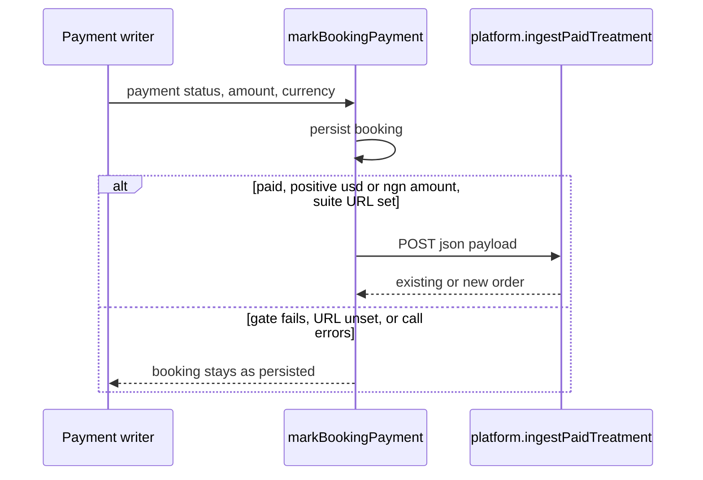

# Paid Treatment Settlement - Plan

**Repos:** `skintwinnector` sends the paid-booking signal. `regima-suite` owns the order ledger. Each unit names its repo. Paths are relative to that repo.

## Goal Capsule

- **Objective:** After a clinic collects payment for a treatment, that charge appears once on the suite orders list, split into therapist, salon, and distributor amounts that add up to the charge. When the provider matches a therapist, that therapist and their salon are on the order.
- **Means:** Suite records one order per paid Connect checkout, and Connect notifies Suite from the existing paid-booking write. (KTD4)
- **Authority:** This plan. Product behavior is owned by the R-IDs. Implementation mechanism is owned by the KTD-IDs. Units cite those IDs and do not restate them.
- **Execution profile:** Standard, payments and auth risk. Cover the split and the ingest with Vitest in each repo. Suite tests pass with no database URL.
- **Stop conditions:** Stop if the three amounts do not add up to the charged total. Stop if a second paid signal inserts a second order or a second settlement event. Stop if a Suite failure changes the booking away from paid. Do not call Paystack. Do not change the Stripe application fee. Do not create an order for a salon sync that has no charged amount.
- **Tail ownership:** One pull request in `regima-suite` for U1–U3, then one pull request in `skintwinnector` for U4.

---

## Product Contract

### Summary

A paid clinic treatment becomes one commission-split order in Regima Suite. The operator's payment still succeeds when Suite is down. Repeat paid signals do not duplicate the order.

Product Contract preservation: bootstrap, no upstream brainstorm.

### Problem Frame

Clinics can already collect a treatment payment on the Connect rail, and Suite already keeps an order ledger with a four-tier commission policy. Nothing connects them. A therapist who performed the treatment, and the salon that hosted it, never see a share of that charge. Seed orders stay on the ledger. New payments do not.

### Requirements

**Ledger**

- R1. A Connect booking that is paid, with a positive `usd` or `ngn` amount, becomes one suite order for that checkout session.
- R2. A later paid signal for the same checkout session returns the existing order and does not add another settlement event.
- R3. The therapist, salon, and distributor amounts add up to the charged total in major units.
- R4. An unpaid status, a missing amount, a zero amount, a negative amount, or any other currency creates no order.

**Attribution**

- R5. When the provider email or provider name matches a suite therapist, the order uses that therapist, that therapist's salon, and the commission-policy row for that therapist's certification level.
- R6. When nothing matches, the order is still created, with no therapist and no salon, using the Foundation policy row.

**Payment and access**

- R7. If Suite has no base URL, is unreachable, or rejects the call, the booking stays paid and the operator still gets a successful payment response.
- R8. A salon sync that marks a booking paid without a charged amount does not create an order.
- R9. The ingest rejects a caller that has neither the platform key nor a valid platform session.
- R10. The new order is pending. Suite records one queued payout event for it and does not send money through Paystack.

### Actors

- A1. Clinic operator — takes payment on Connect. Their receipt does not wait on Suite.
- A2. Therapist — appears on the order only when R5 matches.
- A3. Suite ledger — stores the order and the queued payout event.

### Key Flows

- F1. Paid treatment
  - **Trigger:** A Connect payment writer marks the booking paid with a positive `usd` or `ngn` amount.
  - **Actors:** A1, A3
  - **Steps:** Persist the booking. Notify Suite. Suite inserts one pending order and one queued payout event.
  - **Covered by:** R1, R3, R10
- F2. Repeat paid signal
  - **Trigger:** Webhook and confirmation both report the same paid session.
  - **Actors:** A3
  - **Steps:** Suite finds the existing order by checkout session and returns it.
  - **Covered by:** R2
- F3. Suite unavailable
  - **Trigger:** The suite URL is unset, or the call fails.
  - **Actors:** A1
  - **Steps:** The booking stays paid. The operator's response still succeeds. A later paid signal may try again.
  - **Covered by:** R7
- F4. Unknown provider
  - **Trigger:** The provider name and email match no therapist.
  - **Actors:** A2, A3
  - **Steps:** Suite still inserts the order on the Foundation row, with therapist and salon empty.
  - **Covered by:** R6

### Acceptance Examples

- AE1. Covers R1, R3, R10, F1. Given a paid checkout of 8500 minor `usd` units and a Foundation split, the order total is 85.00 and the three parts are 21.25, 12.75, and 51.00.
- AE2. Covers R2, F2. Given a second paid signal for that same checkout session, the orders list still has one row and one queued payout event.
- AE3. Covers R5. Given a provider email that matches a Master therapist, the order uses that therapist and the Master policy row, not that therapist's stored commission column.
- AE4. Covers R6, F4. Given a provider name that matches nobody, the order exists, the therapist is empty, and the split is the Foundation row.
- AE5. Covers R4, R7, R8, F3. Given an unpaid session, a zero amount, a missing suite URL, or a salon sync with no amount, no order is created, and a paid booking stays paid when the suite call throws.

### Scope Boundaries

**In scope**

- The suite split, the order upsert, the platform ingest, and the Connect notification after a paid booking write.
- Memory persistence so suite tests and a database-less dev server can read the new order back.
- MySQL persistence when Suite already has a database.

**Deferred to Follow-Up Work**

- Linking Connect provider ids to suite therapist emails. Current provider names and suite therapist names do not match, so live bookings follow R6 until that link exists.
- Rewriting seed orders onto the policy table. `t_01` is Master in the policy (4500) and 4000 on the therapist row. Seed rows stay as they are.
- Subtracting the Stripe application fee before the split.
- Executing a Paystack transfer.
- Creating orders for salon syncs once those syncs carry an amount.
- Replacing the confirmation sentence that still says the appointment is not on the clinic schedule.
- Issue #1 asset replacement.
- Live Stripe, Paystack, and Shopify credentials.

**Outside this product's identity**

- Replacing the salon Paystack rail.
- Folding Connect, Suite, the LMS, and the salon app into one codebase.
- Settling LMS course orders. That rail already records local Shopify orders.

---

## Planning Contract

### Key Technical Decisions

- KTD1. Idempotency is a new nullable unique `externalRef` on `orders`, set to the checkout session id. `publicId` stays within `varchar(16)` and `number` stays within `varchar(32)`. Seed rows leave `externalRef` null. Rejected: storing `cs_…` in `publicId` or `number`. Governs R1, R2.
- KTD2. The split runs in integer minor units. Therapist and salon shares are integer division of `amount * bps / 10000`. The distributor share is the remainder. Each share is then divided by 100 for the decimal columns. Rejected: rounding each share independently. Governs R3.
- KTD3. Basis points come from `commission_policy` for the certification level. When the database has no policy row, use `shared/catalog.ts` `commissionPolicy`. Do not read `therapists.commissionBps`, `salons.commissionBps`, or `SKINTWIN_APPLICATION_FEE_BPS`. Governs R3, R5, R6.
- KTD4. Notification runs only after `markBookingPayment` returns a record that passes R4. The call is `POST` `{ json: payload }` to `${REGIMA_SUITE_URL}/api/trpc/platform.ingestPaidTreatment` with `Authorization: Bearer` and `SKINTWIN_PLATFORM_KEY`. A missing URL or key skips the call. A failed call is logged and does not change the booking. A later paid signal may call again. Salon `ingestPlatformRecord` does not notify. Follow the fail-open POST in `regima-training-lms` `server/platform/certifications.ts`. Governs R4, R7, R8.
- KTD5. The ingest writes an in-memory order and settlement event even when `DATABASE_URL` is unset, and upserts MySQL when `getDb()` returns a database. `getOrders` and `getSettlementEvents` return those memory rows only when there is no database. With a database they keep reading MySQL. Governs R1, R2, R10.
- KTD6. The order's `splitStatus` is `pending`. The single settlement event uses `payout.queued`. A repeat ingest does not insert another event. Governs R2, R10.

Bake-off was not used. The policy table versus the therapist column, and a Connect push versus a Suite pull, are both concrete in the current code. The policy table is the only source whose parts sum to 10000 by an existing check. Push matches the LMS caller that already POSTs to Suite. The idempotency column is forced by the existing string widths.

### High-Level Technical Design

The payload carries the checkout session id, the minor-unit amount, the currency, the provider name, an optional provider email, the client display name, and the source. It does not carry the client email as the therapist email.

### Assumptions

No person confirmed this phase. The request was to continue SkinTwin development. The bets below are the agent's, and any of them can be rejected.

- The next phase is this ledger link. Rejected for this increment: FurEver asset replacement, live payment keys, and a new product surface.
- Unmatched providers still create a Foundation order. Rejected: dropping the order until a therapist matches, which would hide the charge.
- The split is of the charged total, not the total minus the 10% Stripe application fee. Rejected: netting the fee out, which would make the three policy parts no longer describe the charge the operator took.
- `splitStatus` stays `pending` because this increment does not pay anyone out. Rejected: marking the row `settled`, which the seed uses for money that already moved.
- Connect may notify on every paid write. Suite dedupes. Rejected: suppressing the call after the first success inside Connect, which would skip a retry after a lost response.
- Current catalogs will not attribute live bookings. `app/data/providers.json` names are not suite therapist names, and providers have no email. R5 is proven with a test therapist, not by editing those catalogs.

### System-Wide Impact

Connect and Suite stay separate processes. The new write crosses that boundary with the platform key both apps already share. Orders are major-unit decimals. Connect amounts are minor units. The conversion happens once, in the suite split. `orders.list` stays public. The new write does not.

### Risks

- A short provider name can substring-match a therapist because `matchTherapistByIdentity` already uses `includes`. This plan does not change that matcher. Connect sends the full provider name from `app/data/providers.json`.
- With a database configured and the MySQL upsert failing, the memory row exists but `orders.list` will not show it. The ingest must surface that failure to the Connect log. The booking still stays paid, per R7.
- `t_01` will look inconsistent next to a new Master order. That is the deferred seed mismatch, not a second formula.

### Sources

- Paid writes meet at `skintwinnector` `lib/clinicRecords.ts` `markBookingPayment`. Local confirm, the Connect webhook, and checkout retrieve all call it. Salon sync uses `ingestPlatformRecord` and can set paid with no amount.
- Suite orders are inserted only by `regima-suite` `scripts/seed.ts`. There is no order ingest today. Policy rows live in `shared/catalog.ts` and `drizzle/schema.ts`.
- `orders.publicId` is `varchar(16)` and `orders.number` is `varchar(32)`.
- Platform auth to copy is `regima-suite` `platformProcedure` and `server/platform/session.ts`. The HTTP shape to copy is the LMS `ingestCertificationEvent`.

---

## Implementation Units

### U1. Charge split in minor units

**Goal:** Turn a charged minor-unit amount and a policy row into three major-unit parts that add up to the charge.

**Requirements:** R3, R4

**Dependencies:** none

**Files:** `server/settlementSplit.ts`, `server/settlementSplit.test.ts` in `regima-suite`

**Approach:** A pure function. It returns no split when the amount is missing, not a positive integer, or the currency is not `usd` or `ngn`. Otherwise it applies KTD2 using the bps it is given. It does not read the database.

**Execution note:** Write the failing amount cases first, then the function.

**Patterns to follow:** `scripts/check-catalog.ts` for the "three parts equal the total" invariant. Do not copy seed rounding.

**Test scenarios:**

- Given 8500 minor units, `usd`, and Foundation bps 2500/1500/6000, the parts are 21.25, 12.75, and 51.00 and the total is 85.00.
- Given an amount that does not divide evenly by the bps, the distributor part is the leftover minor units and the three major amounts still add up to the charged total.
- Given Master bps 4500/1500/4000, the therapist part follows 4500, not 4000.
- Given amount 0, amount -1, a missing amount, and currency `zar`, the function returns no split.

**Verification:** The four cases pass in the suite Vitest run. No database is required.

### U2. Upsert the order and one payout event

**Goal:** Persist one pending order per checkout session, and one queued payout event, in memory and in MySQL when a database is configured.

**Requirements:** R1, R2, R5, R6, R10

**Dependencies:** U1

**Files:** `drizzle/schema.ts`, `server/db.ts`, `server/db.memory.test.ts` in `regima-suite`

**Approach:** Add nullable unique `externalRef`. On first insert, mint a short `publicId` and `number` that fit KTD1, store the currency in uppercase, and set `storeSlug` from the matched therapist or `skintwin-connect` when unmatched. Customer is the client display name, or `Client` when the name is missing. Look up the therapist with `matchTherapistByIdentity`. Load bps per KTD3. Apply KTD5 and KTD6. A second call with the same `externalRef` returns the stored order. When a database is configured, that stored order is the MySQL row. If the MySQL upsert throws, the call fails and does not report an existing order, so a later paid signal can try again.

**Patterns to follow:** `ingestCertification` and `getTherapists` for the memory-plus-MySQL split. `scripts/seed.ts` for the order columns that already exist.

**Test scenarios:**

- Given a new `cs_test_1` with 8500 `usd` and no matching therapist, memory `getOrders` returns one pending order, Foundation parts, empty therapist and salon, and `getSettlementEvents` returns one `payout.queued`.
- Given the same checkout session again, the public id is unchanged and there is still one payout event.
- Given a database is configured and the MySQL upsert throws, the call fails and does not report an existing order.
- Given a memory therapist whose email matches the payload and whose certification is Master, the order points at that therapist and their salon and uses the Master policy row.
- Given amount 0, `getOrders` gains no row.

**Verification:** `server/db.memory.test.ts` passes with `DATABASE_URL` unset. The schema still accepts existing seed inserts that leave `externalRef` null.

### U3. Authenticated paid-treatment ingest

**Goal:** Expose the upsert as `platform.ingestPaidTreatment` so only a platform key or a platform session can call it.

**Requirements:** R9

**Dependencies:** U2

**Files:** `server/routers.ts`, `server/platform.test.ts` in `regima-suite`

**Approach:** Add the mutation beside `platform.ingestCertification`. Do not mount it on `platformProcedure` alone. That middleware accepts any signed-in suite user, and a suite login is not a platform session. Accept the call only when `Authorization` is the raw `SKINTWIN_PLATFORM_KEY` or a signed platform session, or when the `skintwin_platform` cookie is a signed platform session. The input carries the checkout session id, minor amount, currency, provider name, optional provider email, customer name, and source. The procedure calls the U2 function. It does not trust a client-supplied split.

**Patterns to follow:** `server/platform.test.ts` callers built with `createPublicContext` and `issuePlatformSession`. `server/_core/trpc.ts` `requirePlatform` shows the suite-user shortcut this mutation must not copy.

**Test scenarios:**

- Given no authorization header and no platform cookie, the caller is rejected and the db helper is not called.
- Given a signed-in suite user and no platform header or platform cookie, the caller is rejected and the db helper is not called.
- Given `Authorization: Bearer` and the raw `SKINTWIN_PLATFORM_KEY`, the helper is called with the checkout session id and the amount.
- Given a token signed with a different secret, the caller is rejected and the helper is not called.

**Verification:** The three cases pass in `server/platform.test.ts` without a database.

### U4. Notify Suite after a paid booking write

**Goal:** After a booking is marked paid with a charge Suite can record, Connect POSTs that charge and keeps the booking paid if Suite does not answer.

**Requirements:** R1, R4, R7, R8

**Dependencies:** U3

**Files:** `lib/suiteSettlement.ts`, `lib/suiteSettlement.test.ts`, `lib/clinicRecords.ts`, `lib/clinicRecords.test.ts` in `skintwinnector`

**Approach:** Call the notifier from `markBookingPayment` only when the returned record passes the R4 gate in KTD4. Resolve the provider name from `app/data/providers.json` by `appointment.providerId`. Send a provider email only when that record has one. Do not send the client email as the therapist email. Do not call the notifier from `ingestPlatformRecord`.

**Patterns to follow:** `regima-training-lms` `server/platform/certifications.ts` for the URL, the `{ json: payload }` body, and the fail-open result. `lib/clinicRecords.test.ts` for memory bookings with `dbConnect` mocked to reject.

**Test scenarios:**

- Given a paid booking with amount 8500 and currency `usd`, and both `REGIMA_SUITE_URL` and `SKINTWIN_PLATFORM_KEY` set, fetch is called once with a Bearer header and a JSON body whose checkout session id is that booking.
- Given the same booking marked paid again, fetch is called again.
- Given payment status `unpaid`, amount 0, currency `eur`, or `REGIMA_SUITE_URL` unset, fetch is not called.
- Given fetch throws, `markBookingPayment` still resolves and the booking stays paid.
- Given `ingestPlatformRecord` with a paid status and no amount, fetch is not called.

**Verification:** Existing clinic-record tests still pass with the suite URL unset. The new cases pass in the Connect Vitest run.

---

## Verification Contract

`regima-suite`: `pnpm test` and `pnpm check`. The new tests live under `server/` and pass with `DATABASE_URL` unset. `pnpm catalog:check` still passes because seed orders are unchanged.

`skintwinnector`: `yarn test` and `yarn validate-change`.

No browser pass is required for this increment. The orders page already renders `orders.list`. A database-backed click-through is deferred until `DATABASE_URL` is configured.

---

## Definition of Done

- U1 through U4 meet their verification lines.
- AE1 through AE5 are covered by the scenarios that cite them.
- Seed orders and the Stripe application fee are unchanged.
- Abandoned experiments are not left in either diff.
- The suite pull request does not include Connect changes. The Connect pull request does not include suite changes.
