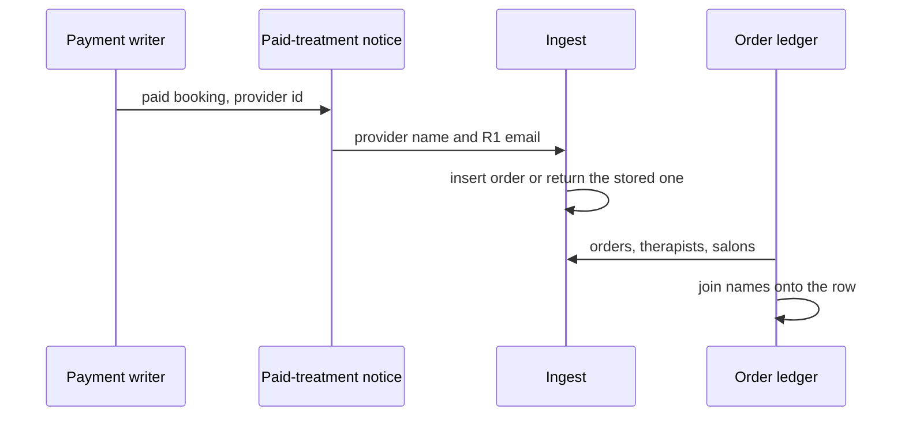
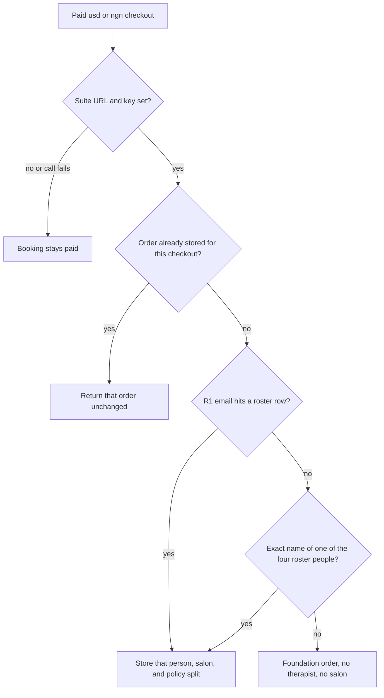
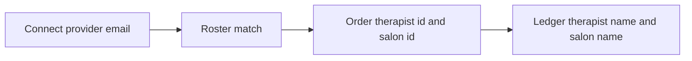

# Provider Therapist Attribution - Plan

**Repos:** `regima-suite` owns the roster, the order, and the ledger. `skintwinnector` sends the paid-treatment notice. Each unit names its repo. Paths are relative to that repo.

## Goal Capsule

- **Objective:** After a clinic takes payment for a treatment with Amara Johnson, Dr. Temi Okonkwo, Chioma Adeyemi, or Ngozi Eze, the new suite order names that person and their salon, and the three shares match that person's certification. An order already on the ledger keeps the person, salon, and shares it already has. A payment for anyone else still appears, with no therapist name and no salon name.
- **Means:** Those four people join the suite roster under a stable email, and the paid-treatment notice sends that email. (KTD1)
- **Authority:** This plan. Product behavior is owned by the R-IDs. Implementation mechanism is owned by the KTD-IDs. Units cite those IDs and do not restate them.
- **Execution profile:** Standard. Payments and stored roster data. Cover attribution, replay, and ledger names with the existing Vitest runners. Suite tests pass with no database URL.
- **Stop conditions:** Stop if a new payment for one of those four people names someone else. Stop if a second notice for an existing checkout changes the therapist, the salon, or the shares. Stop if applying the roster deletes orders. Do not call Paystack. Do not change the split formula. Do not subtract the Stripe application fee.
- **Tail ownership:** One pull request in `regima-suite` for U1 and U3. Deploy it so a paid notice for Amara Johnson matches her row before `skintwinnector` sends the roster emails in U2. A checkout stored before that match stays unnamed.

---

## Product Contract

### Summary

A new paid clinic treatment is attributed to the Connect provider who performed it, and the suite ledger shows that person's name and salon. Orders already stored stay as they are.

Product Contract preservation: bootstrap, no upstream brainstorm. No person confirmed this phase. The R-IDs are the agent's reading of the next increment after paid-treatment settlement. The bets are under Assumptions.

### Problem Frame

Clinics can already collect a treatment payment, and Suite already stores one order per checkout with a therapist, salon, and distributor split. On a live booking the therapist and salon are empty. Connect's providers are Amara Johnson, Dr. Temi Okonkwo, Chioma Adeyemi, and Ngozi Eze. Suite's roster is seven other people, and those rows have no email. The person who did the treatment never appears on the order the operator reads.

### Requirements

**Attribution**

- R1. A new paid `usd` or `ngn` checkout for a provider in the roster below becomes one suite order for that person, that salon, and that store.

| Connect id | Public id | Name             | Email                             | Salon                           | Store                       | Certification |
| ---------- | --------- | ---------------- | --------------------------------- | ------------------------------- | --------------------------- | ------------- |
| prv-001    | t_08      | Amara Johnson    | amara.johnson@clinic.skintwin.ai  | Skin Atelier Sandton (`s_01`)   | rzone-sa                    | Master        |
| prv-002    | t_09      | Dr. Temi Okonkwo | temi.okonkwo@clinic.skintwin.ai   | Wandsworth Clinic (`s_06`)      | regima-dr-h-wandsworth-town | Advanced      |
| prv-003    | t_10      | Chioma Adeyemi   | chioma.adeyemi@clinic.skintwin.ai | House of Glow Rosebank (`s_02`) | rww-regimastore-co-za       | Professional  |
| prv-004    | t_11      | Ngozi Eze        | ngozi.eze@clinic.skintwin.ai      | Atelier Umhlanga (`s_03`)       | regima-za-dst               | Foundation    |

- R2. The therapist, salon, and distributor shares on that order are the commission-policy row for that certification, and they add up to the charged total.
- R3. A later paid signal for the same checkout session returns the existing order and does not change the therapist, the salon, or the shares.
- R4. A paid checkout for any other provider still becomes one order, with no therapist and no salon, on the Foundation policy row.
- R5. An order stored before this roster exists keeps the therapist, salon, and shares it already has. That includes a Foundation order with neither name.

**Ledger**

- R6. The order ledger shows the therapist's current name and the salon's current name when those ids are on the order. Both are blank when the id is missing or the row is missing. The share amounts stay on the order.
- R7. If Suite has no base URL, is unreachable, or rejects the notice, the booking stays paid.

### Actors

- A1. Clinic operator — takes payment. The receipt does not wait on Suite.
- A2. Performing provider — Amara Johnson, Dr. Temi Okonkwo, Chioma Adeyemi, or Ngozi Eze. The new order names this person.
- A3. Suite operator — reads the order ledger.

### Key Flows

- F1. Paid treatment by a roster provider
  - **Trigger:** A Connect payment writer marks the booking paid with a positive `usd` or `ngn` amount for one of the four providers.
  - **Actors:** A1, A2, A3
  - **Steps:** Persist the booking. Notify Suite with that provider's email. Suite inserts one pending order for that person and salon, and one queued payout event.
  - **Covered by:** R1, R2, R7
- F2. Repeat paid signal
  - **Trigger:** Webhook and confirmation both report the same checkout, including one that was stored before the roster existed.
  - **Actors:** A3
  - **Steps:** Suite returns the existing order.
  - **Covered by:** R3, R5
- F3. Unknown provider
  - **Trigger:** The provider is not one of the four, or the email does not match and the name does not match.
  - **Actors:** A3
  - **Steps:** Suite inserts the order with no therapist and no salon.
  - **Covered by:** R4
- F4. Read the ledger
  - **Trigger:** The suite operator opens the order ledger.
  - **Actors:** A3
  - **Steps:** Rows with a therapist and salon show those names. Rows without them show the names blank and still show the shares.
  - **Covered by:** R6

### Acceptance Examples

- AE1. Covers R1, R2, F1. Given a new paid checkout of 8500 minor `usd` units for Amara Johnson, the order names Amara Johnson and Skin Atelier Sandton, and the shares are 38.25, 12.75, and 34.00.
- AE2. Covers R1, R2. Given the same amount for Ngozi Eze, the order names Ngozi Eze and Atelier Umhlanga, and the shares are 21.25, 12.75, and 51.00.
- AE3. Covers R3, R5, F2. Given a Foundation order already stored for a checkout, a second paid signal that now carries Amara Johnson's email returns that order with no therapist and no salon.
- AE4. Covers R4, F3. Given a paid checkout whose provider name is "Someone Else" and whose email matches nobody, the order has no therapist and no salon, and the shares are the Foundation row.
- AE5. Covers R6, F4. Given one order with Amara Johnson's ids and one order with neither id, the ledger shows her name and Skin Atelier Sandton on the first, and blank names on the second. Both still show their share amounts.
- AE6. Covers R7. Given a missing suite URL or a failed notice, the booking stays paid and no second order appears.

### Scope Boundaries

**In scope**

- The four roster rows, the emails on the Connect providers, the notice that already sends an email when one is present, and the ledger names.
- An additive insert for a database that already has orders.
- In-memory roster and salon lists when Suite has no database, so a database-less server can attribute and display names.
- Fresh seed inserts that include the email column and the four rows.

**Deferred to Follow-Up Work**

- Rewriting an existing Foundation order onto a therapist after the roster exists.
- A unique index on therapist email, and changing first-hit matching.
- Showing therapist and salon names on Home or in the command palette.
- Copying the emails into `skintwin-salon` `src/data/providers.json`.
- Creating orders for salon syncs.
- Subtracting the Stripe application fee before the split.
- Executing a Paystack transfer.
- Rewriting seed orders onto the policy table.
- Issue #1 asset replacement.
- Live Stripe, Paystack, and Shopify credentials.

**Outside this product's identity**

- Replacing the salon Paystack rail.
- Folding Connect, Suite, the LMS, and the salon app into one codebase.
- Settling LMS course orders.

---

## Planning Contract

### Key Technical Decisions

- KTD1. The link is the email on R1, carried on the existing optional `providerEmail` field. The four people are new therapist rows `t_08` through `t_11`, whose names are the Connect provider names. Rejected: putting a Connect email on an existing roster person such as Dr Lerato Nkosi, and rejected: a new provider-id column. The order already displays the matched row, the two catalogs are different people, and the notice already sends email, so a prototype competition was not required. Governs R1.
- KTD2. Idempotency stays the checkout session on `orders.externalRef`. A stored order is returned unchanged. When a database is present, startup may insert a missing `t_08`–`t_11` row, or fill a null email on that public id. It does not delete orders, it does not change certification on a row that already exists, and it does not replace an email that is already set. If the salon public id is missing, that insert is skipped and logged. Rejected: `pnpm db:seed` as the way to apply the roster. Governs R3, R5.
- KTD3. Certification and salon on a new row are the R1 table. The split reads `commission_policy` for that certification, then `shared/catalog.ts` `commissionPolicy` when the database has no policy row. It does not read `therapists.commissionBps` or the Connect diploma strings. A new row's `commissionBps` equals that policy row's therapist share. Existing rows, including `t_01`, stay as they are. Governs R2.
- KTD4. With no database, process start copies catalog salons and catalog therapists, including the R1 rows, into the in-memory lists. `resetPlatformMemoryForTests` clears those lists and does not copy them back. Ingest after a reset reads the cleared roster. `getSalons` with no database returns the in-memory salons. Governs R1, R4, R6.
- KTD5. Ledger names are a join of the order's therapist id and salon id to the current lists. The join lives in a shared helper the ledger calls. Blank is an empty string. Home and the command palette are unchanged. Governs R6.
- KTD6. The four emails are distinct and are not the `name@skintwin.ai` form `emailFromUsername` uses. Paid-treatment matching is canonical email, then an exact name. A hit counts only when the row is one of `t_08` through `t_11`. The contains-name step does not attribute a paid treatment. Other callers of `matchTherapistByIdentity` stay as they are. Governs R1, R4.

### High-Level Technical Design

### Assumptions

No person confirmed this phase. The request was to continue SkinTwin development. The bets below are the agent's, and any of them can be rejected.

- The next phase is this attribution. Rejected for this increment: Paystack payout, fee netting, seed-order rewrite, asset replacement, live payment keys, and a new product surface.
- The four Connect providers are the performers. Rejected: aliasing them onto the seven existing therapists, which would put Dr Lerato Nkosi on a booking the client made with Amara Johnson.
- Salons and certifications in R1 are a demo map. Nothing in either catalog assigns them. Rejected: deriving certification from Connect diploma strings.
- Orders stored before the roster exist stay unattributed. Rejected: rewriting them on the next notice.
- The ledger row and its inspector are the only name surfaces. Rejected: also changing Home and the command palette in this increment.
- A database-less server should show the same names a fresh seed would. Rejected: proving attribution only in tests while the empty in-memory roster still writes Foundation orders.

### System-Wide Impact

Connect and Suite stay separate processes. The notice shape does not gain a field. `therapists.email` already exists and is nullable, so this increment writes data, not a new column. Orders keep numeric therapist and salon ids. The ledger learns the names from the lists it already loads. `orders.list` stays as it is. A later LMS certification whose email equals an R1 email still updates that row's certification, and later new orders then use the new policy row.

### Risks

- Two roster rows with the same email attribute to whichever row comes back first. R1's emails are unused today. The invite form can still save a duplicate later.
- `pnpm db:seed` deletes orders before insert. Startup ensure must not call that path.
- `skintwin-salon` `src/data/providers.json` is a second copy of the four providers and has no email. Salon sync does not notify Suite. The copy can drift.
- A provider email that is present but not a valid email never reaches ingest. The booking stays paid and no order is created. The four R1 addresses are valid. Do not change the route to drop a bad email.
- After a test reset, the in-memory roster is empty. A test that forgets the reset can match Amara Johnson by name once startup has copied the catalog.

### Sources

- Paid notices are built in `skintwinnector` `lib/suiteSettlement.ts`. `providerEmail` is set only when the catalog provider has an email. `lib/clinicRecords.test.ts` currently expects `prv-001` to omit it.
- Connect providers are `skintwinnector` `app/data/providers.json`: `prv-001` through `prv-004`, no email field.
- Suite matching is `regima-suite` `server/platform/identity.ts`. Email, then exact name, then the roster name containing the full event name.
- Ingest returns a stored `externalRef` without updating therapist, salon, or shares in `regima-suite` `server/db.ts`.
- `regima-suite` `client/src/lib/liveData.ts` `mapOrder` drops `therapistId` and `salonId`. `getSalons` and `getTherapists` return empty lists when there is no database.
- `regima-suite` `scripts/seed.ts` inserts therapists without an email column and deletes domain tables first. `shared/catalog.ts` therapists `t_01` through `t_07` have no email and do not include the four Connect names.
- `regima-suite` `vitest.config.ts` runs `server/**/*.test.ts` and `scripts/**/*.test.ts` only.
- The prior increment deferred this link in `docs/plans/2026-09-30-1706-feat-paid-treatment-settlement-plan.md`.

---

## Implementation Units

### U1. Roster rows and a non-destructive ensure

**Goal:** Suite can match the four R1 providers by email, on a fresh seed, on a database that already has orders, and on a database-less server.

**Requirements:** R1, R2, R3, R4, R5

**Dependencies:** none

**Files:**

- `regima-suite` `shared/catalog.ts`
- `regima-suite` `scripts/seed.ts`
- `regima-suite` `server/db.ts`
- `regima-suite` `server/db.memory.test.ts`

**Approach:**

1. Add `t_08` through `t_11` to the catalog with the R1 names, emails, salons, stores, and certifications. Set each new `commissionBps` per KTD3. Leave `t_01` through `t_07` unchanged.
2. Teach the seed insert to write `email`. Include the four rows. Do not use that seed as the backfill.
3. On startup with a database, ensure the four public ids per KTD2.
4. On startup with no database, copy catalog salons and therapists into memory per KTD4. Keep the test reset clearing those lists.

**Patterns to follow:** `createTherapist` for the in-memory therapist shape. The existing unmatched Amara case in `server/db.memory.test.ts`, which expects a null therapist when the roster does not contain her.

**Test scenarios:**

- Covers AE1. After the in-memory lists hold the R1 rows, ingest 8500 minor `usd` units with `providerEmail` `amara.johnson@clinic.skintwin.ai` and `providerName` `Amara Johnson`. The order's therapist is Amara Johnson, the salon is Skin Atelier Sandton's id, the store is `rzone-sa`, and the shares are 38.25, 12.75, and 34.00.
- Covers AE2. The same amount with `ngozi.eze@clinic.skintwin.ai` names Ngozi Eze, uses Atelier Umhlanga's id, and the shares are 21.25, 12.75, and 51.00.
- Covers AE3. An order already stored for `cs_existing` with a null therapist is returned unchanged when a second ingest sends Amara Johnson's email.
- Covers AE4. After a test reset, ingest `providerName` `Someone Else` and no email. The order has a null therapist, a null salon, store `skintwin-connect`, and Foundation shares.
- After a test reset, ingest `providerName` `Amara Johnson` and no email. The therapist stays null. Name match must not see the startup copy.
- With the R1 rows loaded, ingest `providerName` `Amara Johnson` and no email. The therapist is Amara Johnson.
- With the R1 rows loaded, ingest `providerName` `Johnson` and no email. The therapist stays null. A contains-name hit does not attribute.
- An ensure against a roster that already has `t_08` with a different email leaves that email and does not delete orders.
- An ensure against a roster missing `s_01` skips `t_08` and still inserts a later row whose salon is present.

**Verification:** The memory tests above pass with no database URL. Existing paid-treatment cases in the same file still pass.

### U2. Send the roster email from Connect

**Goal:** A paid booking for `prv-001` through `prv-004` notifies Suite with that provider's R1 email.

**Requirements:** R1, R7

**Dependencies:** U1

**Files:**

- `skintwinnector` `app/data/providers.json`
- `skintwinnector` `lib/clinicRecords.test.ts`

**Approach:**

1. Add the R1 email to each of the four providers. Do not add a provider id to the notice body.
2. Update the `prv-001` paid-booking assertion so the posted body includes `amara.johnson@clinic.skintwin.ai` and still omits the client email.

**Patterns to follow:** `lib/suiteSettlement.ts` already copies `provider.email` onto `providerEmail`. `lib/clinicRecords.test.ts` stubs fetch and reads `body.json`.

**Test scenarios:**

- A paid `usd` booking with `providerId` `prv-001` posts `providerName` `Amara Johnson` and `providerEmail` `amara.johnson@clinic.skintwin.ai`. The client email is absent.
- The same booking for `prv-004` posts `ngozi.eze@clinic.skintwin.ai`.
- An unpaid booking, a zero amount, and a missing suite URL still do not post.
- A paid booking whose `providerId` is not in the catalog posts `providerName` `""` and omits `providerEmail`.

**Verification:** Connect's booking tests pass. The notice helper does not grow a new field. Do not send these emails until the suite roster is deployed and a paid notice for Amara Johnson matches her row. A checkout stored before that match stays unnamed.

### U3. Show therapist and salon names on the ledger

**Goal:** The order ledger shows the names R6 requires, and leaves every other order surface alone.

**Requirements:** R6

**Dependencies:** U1

**Files:**

- `regima-suite` `shared/orderNames.ts`
- `regima-suite` `server/orderNames.test.ts`
- `regima-suite` `client/src/lib/liveData.ts`
- `regima-suite` `client/src/pages/Orders.tsx`

**Approach:**

1. Add a shared join that takes an order's therapist id and salon id plus the current therapist and salon lists, and returns the two names per KTD5.
2. Call it from `useLiveData` while mapping orders. Put the names on the order view the ledger already uses.
3. Render both names on the ledger row and in the inspector. Leave the share amounts, the split ribbon, Home, and the command palette unchanged.
4. Show the names only after the therapist list and the salon list have loaded. While either list is still loading, those cells use the ledger's existing loading line. A failed list leaves the names blank. Do not treat an in-flight list as an empty roster.

**Patterns to follow:** `mapOrder` in `client/src/lib/liveData.ts`. The therapist directory already resolves a salon name from `salonId`.

**Test scenarios:**

- Covers AE5. An order with therapist id 8 and salon id 1, against lists that contain Amara Johnson and Skin Atelier Sandton, returns those two names.
- An order with null ids returns two empty strings.
- An order whose ids are not in the lists returns two empty strings. The share amounts on the order are not inputs to the join.
- A list with two salons returns the salon whose id matches, not the first salon.

**Verification:** `server/orderNames.test.ts` passes under the existing server test include. The ledger row and inspector are the only UI callers.

---

## Verification Contract

- `regima-suite` `pnpm test` runs Vitest. U1 and U3 are proven there, with no database URL.
- `skintwinnector` `yarn test` runs Vitest. U2 is proven there.
- No new environment variable. No Paystack call. No Stripe application-fee change.
- A database-less suite server, after startup and without a test reset, matches a new Amara Johnson payment to `t_08` and the ledger can resolve her name from the in-memory lists.

---

## Definition of Done

- U1, U2, and U3 meet their verification.
- AE1 through AE5 hold as the automated cases in U1 and U3. AE6 holds as the U2 case where a missing suite URL does not post and the booking stays paid.
- The suite roster is deployed, and a paid notice for Amara Johnson matches her row, before Connect sends the roster emails.
- Existing Foundation orders are still present after the ensure runs.
- `t_01` through `t_07` are unchanged.
- Abandoned attempt code is not left in the diff.
- The suite pull request is open before the Connect pull request, because U2's emails are the R1 addresses U1 stores.
